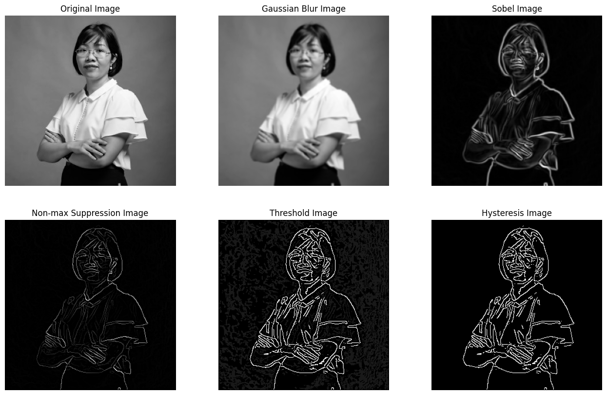
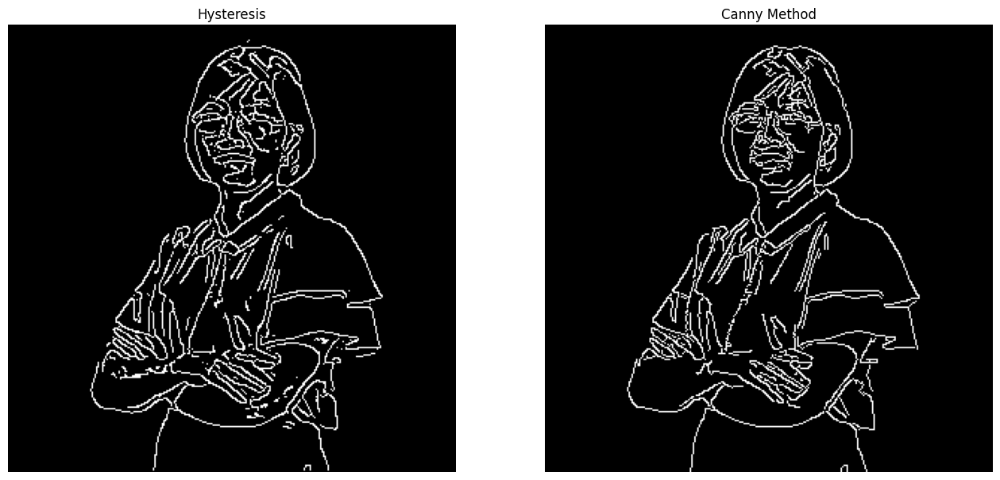

# Image Processing - HUST SEEE
## Canny Edge Detection
Phát hiện biên dựa trên phương pháp Canny và so sánh kết quả thu được so với Canny function của OpenCV.

### 1.  Các yêu cầu trong việc phát hiện biên

- Tỷ lệ lỗi thấp
- Đảm bảo các đường biên mỏng, cường độ biên lớn và liên tục
- Khả năng phát hiện và loại bỏ nhiễu tốt

Chú ý: Ảnh phải  được chuyển thành Gray trước khi bắt đầu xử lý biên\

### 2. Các bước thực hiện
Phương pháp Canny gồm 4 bước:

- Giảm nhiễu (Noise reducation)
- Tính toán hướng và cường độ pixel (Gradient calculation)
- Loại bỏ các điểm không cực đại (Non-max Suppression)
- Dò các điểm trên biên bằng ngưỡng kép (Hysteresis thresholding)

### 3. Kết quả
Ảnh đầu vào là ảnh màu, kích thước 300x300

#### 3.1 Kết quả thu được sau khi thực hiện 4 bước phát hiện biên

#### 3.2 So sánh với Canny function trên OpenCV
kết quả thu được cho đường biên mỏng hơn so với Canny function của OpenCV. Tuy nhiên việc sử lý các đường biên ngắn vẫn chưa thực sự tốt và tính liên tục vẫn còn kém hơn một chút so với Canny function.

 
